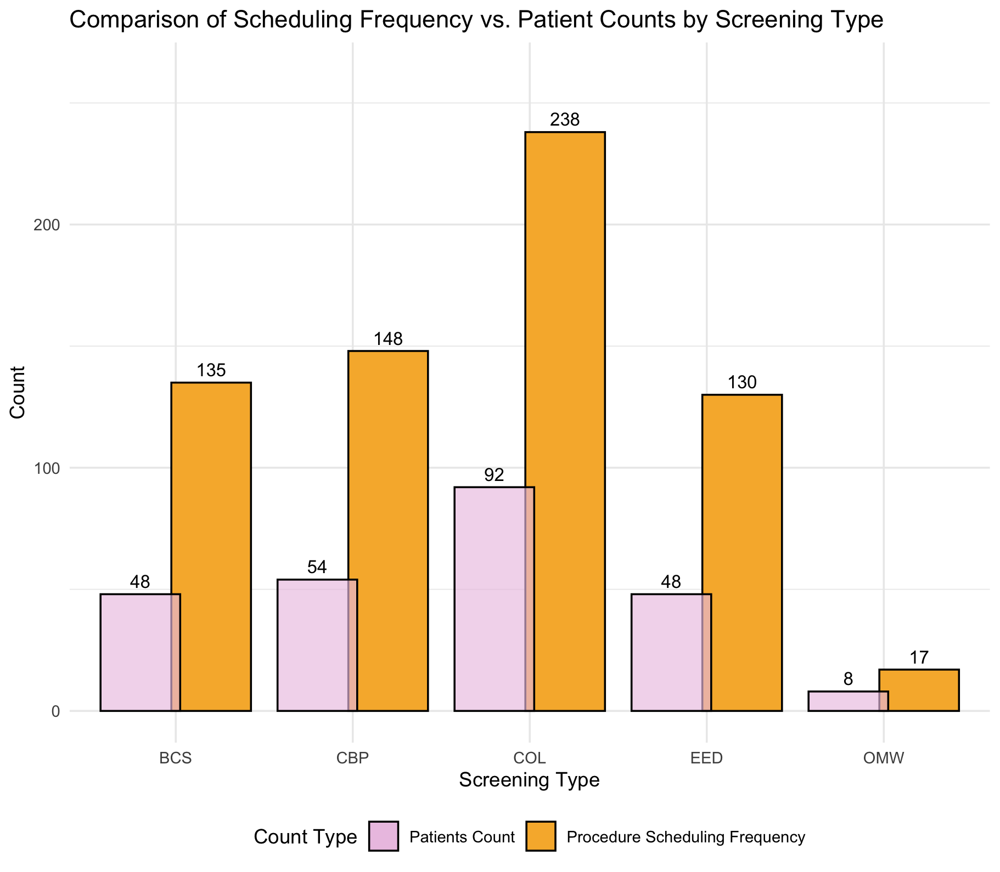

# Outbound Nursing Team Call Analysis

**DataCamp Data Analyst Certification — Practical Exam**

# Outbound Nursing Team Call Analysis

**DataCamp Data Analyst Certification — Practical Exam**


*Call frequency distribution by patient count, shown with alpha transparency so both groups and their overlap are visible.*

## Business Problem

Universal Healthy Humans Company wants to increase screening compliance rates. An outbound nursing team contacts patients who have not completed their required health screenings. The hospital wants to understand:

- How many patients were successfully reached?
- Was there a difference in compliance based on how many screenings a patient was eligible for?
- Were patients more likely to complete their screening after the nursing team reached out?
- How should the outbound calls be optimized?

## Dataset

**`outbound_call_nursing_team.csv`** — 1,988 records of patient screening and outreach data.

| Column | Description |
|---|---|
| `patient_id` | Unique identifier for each patient |
| `screening_type` | Type of screening (BCS, CBP, COL, EED, OMW) |
| `screening_completed_ind` | Whether the screening was completed (1 = yes, 0 = no) |
| `latest_call_date` | Date of the most recent outbound call attempt |
| `reached_ind` | Whether the patient was reached by phone (1 = reached, 0 = not reached) |
| `screening_date` | Date the screening was scheduled or completed |

## Key Findings

- Of 166 patients, only 40% were successfully reached by the nursing team, while 44% were never called.
- Patients with more eligible screening types trended toward lower initial compliance (p = 0.058)*, suggesting the program should prioritize patients with multiple screenings.
- "Reached" and "Not Reached" patients had very similar completion rates — making contact may not be as important as simply making an attempt.
- A Scheduling Efficiency Ratio (SER) metric was proposed; current values range from 2.12x (OMW) to 2.81x (BCS), indicating significant rescheduling overhead.
- An A/B test with demographic data is recommended to identify which patient profiles benefit most from outreach.

\* *The p = 0.058 value referenced above has been updated. See the revised analysis below.*


## Analysis Revision

I came back to this analysis after doing some related work and noticed the original handling of the data missed a structural pattern. This section explains what I found and what I changed.

The original analysis used `drop_duplicates` with `keep='first'` on records where the same patient had both a 1 and a 0 for completing the same screening on the same date. That just kept whichever row happened to come first in the file. Looking at the data again, 152 of the 369 appointment groups have these contradictory completion flags, and no appointment group has only 0 records. The 0s are not real missed visits. This is data entry inconsistencies where the same scheduled visit was recorded both as scheduled and as completed. There was no standard process for data entry, or at least not one that was followed consistently.

The fix was to look at the date column instead of trying to figure out which completion flag is right. All screenings for a patient are scheduled on the same day. One date for a screening type means they completed it at first visit. Multiple dates means they were rescheduled. That logic bypasses the contradictions and uses what the data is actually telling you.

Under this approach the Q2 regression result went from marginal (p = 0.058) to highly significant. The same 132 patients now break out as 80 completed and 52 not completed at first visit instead of 111 completed and 21 not. Same model, much stronger result.

The date analysis showed something else. All called patients have their latest call date before their first scheduled screening date. The program is proactive outreach, not follow-up after missed visits. The mean gap between the call and the first scheduled visit is 67 days for Reached patients and 37 days for Not Reached patients.

Stratifying by number of screening types added more nuance. For single-type patients, call status does affect outcomes (Kruskal-Wallis p = 0.013 on reschedule counts). For patients with two or more screening types, there is no detectable call-status effect. The original analysis treated call status as a single program-wide variable, which hid this difference.

## Repository Structure

```
├── README.md
├── LICENSE
├── notebook.ipynb                        # Full analysis and report
├── Data Analyst Presentation .pdf        # Non-technical presentation (PDF)
├── Data Analyst Presentation .key        # Non-technical presentation (Keynote)
├── outbound_call_nursing_team.csv
└── figures/
    ├── patients_by_call_status.png
    ├── Comparison_Frequency_Patient_Count.png
    ├── Compliance_rate_eligible_screenings.png
    ├── initial_compliance.png
    ├── mean_completion_rates.png
    ├── number_screening_scheduled.png
    ├── screening_completion_grouped.png
    └── screening_completion_proportions_call_screening.png
```

## Tools & Packages

- **Language:** R
- **Environment:** DataCamp DataLab
- **Packages:** tidyverse, stringr, lubridate, ggplot2, scales, glue, rstatix, ggsignif, ggtext

## Author

Jessene Aquino-Thomas

## License

This project is licensed under the MIT License — see the [LICENSE](LICENSE) file for details.

---

*Completed as part of the [DataCamp Data Analyst Certification](https://www.datacamp.com/portfolio/jaquinothomas), December 2025.*
